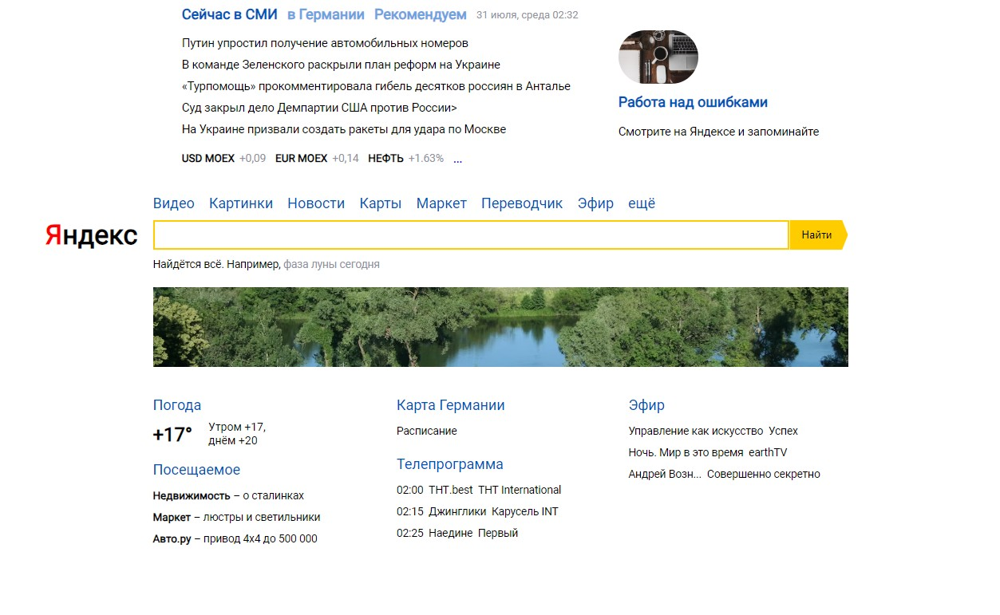

# Декомпозиция

Учебный проект курса [React для JS-разработчиков](https://netology.ru/programs/react)

## **Задача**

Разбиение заданного интерфейса на компоненты

## **Описание реализации**

* Интерфейс разбит на компоненты и в файле каждого компонента записаны короткие  комментарии, за что данный компонент отвечает. Использован формат JSDoc.
* Повторяющиеся компоненты сделаны настраемыми за счёт props. 
## **Стек технологий**

## [**Демо**](https://decomposition.vercel.app/)

